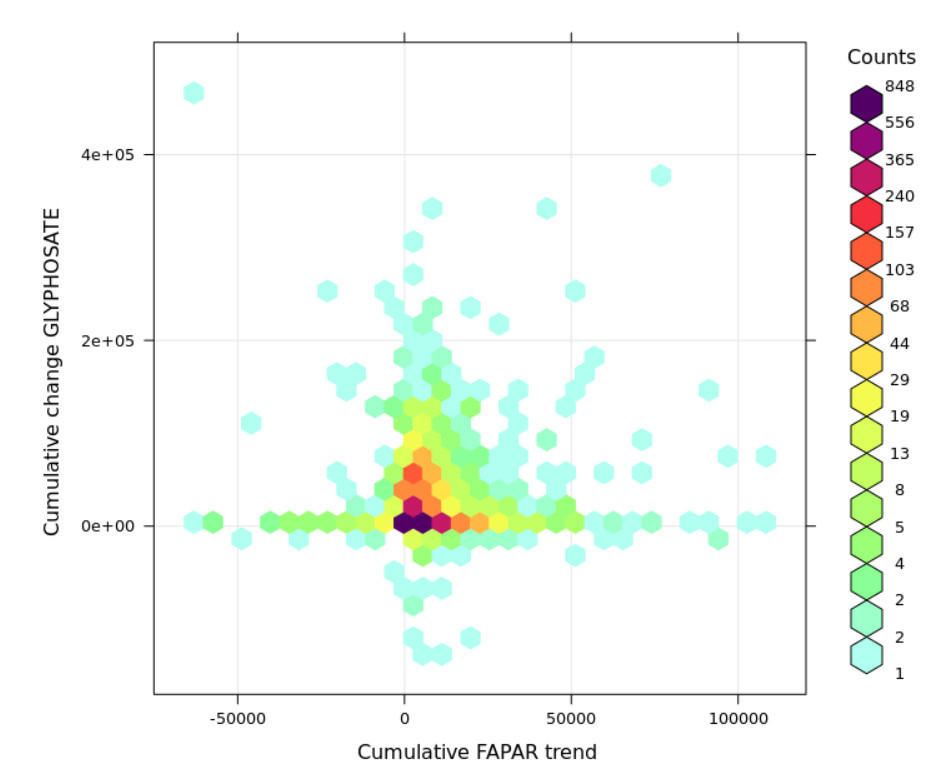

# Estimated Annual Agricultural Pesticide Use for USA48 2000 to 2019
Tom Hengl (EnvirometriX) and Colby Brungard (New Mexico State
University)

## Annual Agricultural Pesticide Use

Annual agricultural pesticide use in USA is documented by [USGS with
data publicly available as csv
files](https://water.usgs.gov/nawqa/pnsp/usage/maps/county-level/).
These show the pesticide use per county estimated from various records,
mainly the census data (Baker and Stone 2015). Falcone, Murphy, and
Sprague (2018) have produced several of layers quantifying atmospheric
deposition, agricultural production, livestock, urbanization,
irrigation, land use, nutrients from fertilizer, dams/reservoirs, and
pesticide use for USA. Maps of pesticides use are already [available at
1-km](https://doi.org/10.5066/P9CG7KW8) i.e.  a total of 505 rasters
posted (101 compounds x 5 years), however covering only 2013 to 2017.

In this notebook we look at how to rasterize these data (from tabular to
gridded) and how to analyze trends in the pesticide use over the last 20
years (2000–2019). This process is referred to as spatial
dis-aggregation or spatial downscaling. One example of spatial
downscaling of is e.g. downscaling of livestock counts from census data
and then using Machine Learning and appropriate covariates (Li, Hou, and
Huang 2021).

The output GeoTIFFs we produced at 250-m spatial resolution are
available for download from
[Zenodo](https://dx.doi.org/10.5281/zenodo.10903369). Some code shown is
over-computational and hence it is shown only for illustration purposes
/ it should be run on a coarser resolution e.g. 1-km or for a subset of
states.

**Disclaimer**: this code and data is under construction and USGS makes
is clearly available that there are some limitations to this data:

- These estimates are made by using projected county crop acres from the
  previous Census of Agriculture and are expected to be revised upon
  availability of updated crop acreages in the following Census of
  Agriculture.
- The files do not include pesticide use estimates for California. Data
  for California are obtained from the online Department of Pesticide
  Regulation-Pesticide Use Reporting (DPR-PUR) database and are
  typically not available at the time the preliminary pesticide use
  estimates are generated for the rest of the U.S.

so please have in mind these limitations when using these maps for
further modeling.

To visualize the pesticide-use data we can first load it using
(long-table with cca 7M records):

``` r
pp = readRDS("./data/EPest.county.estimates.rds")
str(pp)
```

    'data.frame':   7007280 obs. of  7 variables:
     $ COMPOUND        : chr  "2,4-D" "2,4-D" "2,4-D" "2,4-D" ...
     $ YEAR            : num  2000 2000 2000 2000 2000 2000 2000 2000 2000 2000 ...
     $ STATE_FIPS_CODE : chr  "01" "01" "01" "01" ...
     $ COUNTY_FIPS_CODE: chr  "001" "003" "005" "007" ...
     $ EPEST_LOW_KG    : num  1159.9 10183.1 1233.4 70.3 5664.9 ...
     $ EPEST_HIGH_KG   : num  2199.1 10681.3 1635.8 70.5 5705.7 ...
     $ ID              : chr  "01_001" "01_003" "01_005" "01_007" ...

The metadata provided by the USGS shows the following:

- `COMPOUND` = Common name for the pesticide compound active ingredient
  (a total of 451);
- `EPEST_LOW_KG` = Estimated pesticide use (low estimate), in kilograms
  (kg). Zero values (0) indicate use was less than 0.01 kg;
- `EPEST_HIGH_KG` = Estimated pesticide use (high estimate), in
  kilograms (kg). Zero values (0) indicate use was less than 0.01 kg;

`COUNTY_FIPS_CODE` is the county code and `YEAR` is the year for which
the pesticide use is reported. The metadata further mentions the
following two documents that contain more technical detail:

- Baker, N.T., and Stone, W.W., 2015, Estimated annual agricultural
  pesticide use for counties of the conterminous United States, 2008–12:
  U.S. Geological Survey Data Series 907, 9 p., accessed July 12, 2015,
  at <https://doi.org/10.3133/ds907>.
- Thelin, G.P., and Stone, W.W., 2013, Estimation of annual agricultural
  pesticide use for counties of the conterminous United States,
  1992–2009: U.S. Geological Survey Scientific Investigations Report
  2013–5009, 54 p., accessed July 12, 2015, at
  <http://pubs.usgs.gov/sir/2013/5009/>.

The RDS file above was produced by importing and binding annual csv
files:

```` markdown
```{r}
epst.lst = list(sapply(2000:2012, function(i){paste0("./pesticides/EPest.county.estimates.", i, ".txt")}), 
                "./pesticides/EPest_county_estimates_2013_2017_v2.txt", 
                sapply(2018:2019, function(i){paste0("./pesticides/EPest_county_estimates_", i, ".txt")}))
pp = plyr::rbind.fill(lapply(epst.lst, vroom::vroom))
pp$ID = paste0(pp$STATE_FIPS_CODE, "_", pp$COUNTY_FIPS_CODE)
saveRDS.gz(pp, "./data/EPest.county.estimates.rds")
```
````

Next, we can quickly visualize trends in some key pesticides over the
years. For this we use the [openair
package](https://davidcarslaw.github.io/openair/):

``` r
sel.pp = c("GLYPHOSATE", "ATRAZINE", "ACETOCHLOR", "METOLACHLOR")
df = pp[pp$COMPOUND %in% sel.pp,]
openair::scatterPlot(df, y="EPEST_HIGH_KG", x="YEAR", 
                     method="hexbin", col="increment", type="COMPOUND", #log.y=TRUE, 
                     ylab="EPEST_HIGH_KG", xlab="Year")
```


To focus on a specific county e.g. Livingston county in the Illinois
state, we can run:

``` r
library(tidyverse)
library(lubridate)
## Livingston county
df$date = ymd(paste0(df$YEAR, "/06", "/15"))
df[df$ID=="17_105",] %>% ggplot( aes(x = date, y = EPEST_HIGH_KG, color = COMPOUND, group = COMPOUND)) +
geom_line() + geom_point() +   theme_test()
```


From the four most frequent compounds, all seem to have a constant or an
increase in use, but especially the Glyphosate seem to be increasingly
used from 2006/2007/2008. Note these numbers only shows total pesticides
use per county. Because each county is different size, and because
percentage of agricultural land within each county differs, we really
want to estimate the pesticide use in kg/km-square (or
pounds/mile-square, where 1 kg/km2 = 5.71 pounds/mile2). In other words,
we wish to produce a map such as this:


To do this, we need to try to estimate area / percent of agricultural
land for each year for USA48. We then have to dissagregate the pesticide
use per compound, estimate the cropland area and then subset pixels to
cropland mask.

## Agricultural land maps

Exact distribution of crop acres are not available in the tabular data,
but we can estimate it from the USGS’s [National Land Cover Database
(NLCD)](https://www.usgs.gov/centers/eros/science/national-land-cover-database)
which is available at high spatial resolution for years 2001, 2004,
2006, 2008, 2011, 2013, 2016, 2019, 2021. To estimate the percent of
agricultural land, we need to assign to each NLCD class what is the
percentage of the class having agricultural / cropland. This is an
example of how we can simply assign percentages:

``` r
rcl = read.csv("./data/NLC_legend.csv")
rcl[,c("General_class", "Class_Value", "Croplands")]
```

            General_class Class_Value Croplands
    1               Water          11         0
    2               Water          12         0
    3           Developed          21        50
    4           Developed          22        25
    5           Developed          23         0
    6           Developed          24         0
    7              Barren          31         0
    8              Forest          41         0
    9              Forest          42         0
    10             Forest          43         0
    11          Shrubland          51         0
    12          Shrubland          52         0
    13         Herbaceous          71         0
    14         Herbaceous          72         0
    15         Herbaceous          73         0
    16         Herbaceous          74         0
    17 Planted/Cultivated          81        80
    18 Planted/Cultivated          82       100
    19           Wetlands          90         0
    20           Wetlands          95         0

Using the [terra package](https://rspatial.org/) function `classify` we
can convert values from NLCD to cropland fractions, then resample all 0
to 100% percentages to a coarser resolution of 250-m:

```` markdown
```{r}
in.dir = "/mnt/projects/USA48/landcover/landcover_yearly/"
#nlcd.r = terra::rast(paste0(in.dir, "nlcd_2001_land_cover_l48_20210604.tif"))
rcl = read.csv("./pesticides/NLC_legend.csv")
y = parallel::mclapply(nlcd.lst, function(i){
                     terra::classify(terra::rast(paste0(in.dir, 
                     "nlcd_", i, "_land_cover_l48_20210604.tif")), 
                     rcl[,c("Class_Value", "Croplands")], 
                     filename=paste0("./pesticides/croplands_", i, "_30m.tif"), 
                     gdal=c("COMPRESS=DEFLATE", "TFW=YES","of=COG"), datatype='INT1U')}, 
                     mc.cores=length(nlcd.lst))
## resample to 250m
crp.lst = paste0("./pesticides/croplands_", nlcd.lst, "_30m.tif")
y = parallel::mclapply(crp.lst, function(i){system(paste0('gdalwarp ', i, ' ', gsub("30m", "250m", i), ' 
          -tr 250 250 -te -2540000 119000 2441000 3258000 -r average 
          -co COMPRESS=DEFLATE -ot Byte -overwrite'))}, 
          mc.cores=length(crp.lst))
```
````

This will produce cropland percentage maps at 250~m based on the NLCD
and projected in the same system `EPSG:5070`. Note that we miss some
many years to match the county data, which we can interpolate (between
the years) using e.g.:

```` markdown
```{r}
system('gdal_calc.py -A ./pesticides/croplands_2001_250m.tif -B ./pesticides/croplands_2004_250m.tif 
   --outfile=./pesticides/croplands_2003_250m.tif --co COMPRESS=DEFLATE 
   --calc="(A+B)/2" --quiet --overwrite')
```
````

## Pesticide use density maps

Finally, we have all gridded layers and pesticide use data that we can
integrate and produce maps of pesticide use density (kg/km-square). This
can be done in few steps using the terra package:

1.  Subset the table `pp` containing all records of pesticides use to a
    single compound.
2.  Import the cropland mask and calculate cropland area (in km2) per
    county (about 2000 counties in total).
3.  Rasterize the density of pesticide use and mask out to croplands
    only.
4.  Save as a GeoTIFF and put in the file name compund, type, year and
    spatial resolution.

We can break this into steps and put in a single function that will
produce a GeoTIFF as an output:

``` r
## function to rasterize polygons using agricultural land mask
rast_poly = function(count, pp, compound="GLYPHOSATE", type=c("HIGH","LOW"), year=2000, out.file){
  if(missing(out.file)){
    out.file = paste0("./data/", compound, "_EPEST.", type, ".KG.KM2_", year, "_250m.tif")
  }
  if(any(!file.exists(out.file))){
    mask = terra::rast(paste0("./data/croplands_", year, "_250m.tif"))
    m = mask > 20
    NAflag(m) = 0
    ## number of pixels within each county with land
    area = terra::extract(m, count, fun=function(x){length(na.omit(x))})
    area$LAND.AREA = area[,2] * 250^2 / 1e6 ## square-km
    area$ID = count$ID
    ## subset to compound of interest:
    x <- pp[pp$YEAR==year & pp$COMPOUND==compound,]
    ## add cropland area per county:
    x$LAND.AREA = plyr::join(x["ID"], area)$LAND.AREA
    for(t in 1:length(type)){
      if(!file.exists(out.file[t])){
        ## pesticide use density in kg/km2
        x[,paste0("EPEST_", type[t], "_KG.KM2")] = x[,paste0("EPEST_", type[t], "_KG")] / x$LAND.AREA
        count.x = terra::merge(count, x, by="ID")
        out <- terra::rasterize(count.x, m, field=paste0("EPEST_", type[t], "_KG.KM2"))
        out.f <- terra::mask(out, m)
        writeRaster(out.f, out.file[t], overwrite=TRUE, wopt=list(gdal=c("COMPRESS=DEFLATE"), datatype='INT1U'))
      }
    }
  }
}
```

where function `terra::extract` will overlay the county polygon map with
cropland mask and estimate number of non-NA pixels per county; function
`terra::merge` will copy the values of pesticide use density (kg/km2) to
a new polygon; function `terra::rasterize` will convert the polygon map
to gridded map using the computed field; `terra::mask` will subset
pixels to only the cropland mask, and `writeRaster` will write the
GeoTIFF.

It is important to emphasize that, even though the spatial resolution of
maps is 250-m, these maps still only show pesticide use per county /
cropland mask. To actually downscale pesticide use to better match
reality, one would probably need to use more detailed information on
crop-types (e.g. from the [CropScape
project](https://nassgeodata.gmu.edu/CropScape/)) and similar.

Finally, we can run this code in parallel to speed up computing (it
takes about 20 minutes to rasterize four compounds), but if you switch
to a coarser resolution e.g. 1-km you can significantly speed up
processing:

```` markdown
```{r}
sel.pp = c("GLYPHOSATE", "ATRAZINE", "ACETOCHLOR", "METOLACHLOR")
for(k in sel.pp){
  y = parallel::mclapply(2000:2019, function(i){rast_poly(count, pp, compound=k, year=i)}, mc.cores=10) 
}
```
````

The selected pesticides are among the most commonly used in USA
(Fernandez-Cornejo et al. 2014), but if needed all pesticides can be
rasterized using the same function explained above.

Example of the produced output of the rasterization you can see above.
Note that all produced GeoTIFFs described in this computational notebook
are available from Zenodo at
<https://dx.doi.org/10.5281/zenodo.10903369>.

After we have produced a time series of pesticides use for USA48 we can
visualize and explore it using QGIS. We recommend using for this the
[animation
functionality](https://www.qgistutorials.com/en/docs/3/animating_time_series.html).
The visualization shown below is produced as follows:

1.  Load all time series data into QGIS. Group into a single group
    sorted based on the year.
2.  Specify begin end times for each layer e.g. 2000-01-01 to 2000-12-31
    (now layers have temporal reference).
3.  Run animation tool by selecting the Temporal Control Panel (Clock
    icon) from Map Navigation Toolbar.

This will produce the following animation showing dis-aggregated
Glyposate use (high) from 2000 to 2019:


## Do changes in pesticide use have effect on primary productivity?

Use of pesticides has proven quite controversial. Comont et al. (2019)
and Landau et al. (2023) have found out that weed species are quickly
adapting to the pesticides such as glyphosate, hence they most likely do
not help fighting weed that much any more. At least new more diverse
weed management systems are needed.

In the last step we can check if increase in pesticide use for
glyphosate is trully beneficial  
to e.g. increasing primary productivity. We can use for the this the
FAPAR (Fraction of Absorbed Photosynthetically Active Radiation) trend
data (beta coefficient) set explained in detail in Hackländer et al.
(2024) and matching exactly the 250-m resolution. The positive values in
the FAPAR trend map (2000-2021) indicate increase in FAPAR and negative
decrease. FAPAR is the direct measure of effective photosynthesis and
hence it is a direct estimator of the primary productivity.

First, we estimate the average change in the glyphosate use across 2000
to 2019 using the `diff` function:

```` markdown
```{r}
g = terra::rast(paste0("./pesticides/GLYPHOSATE_EPEST.HIGH.KG.KM2_", 2000:2019, "_250m.tif"))
dif = diff(g, lag=1, filename="./pesticides/diff.GLYPHOSATE_EPEST.HIGH.KG.KM2_250m.tif", 
           wopt=list(gdal=c("COMPRESS=DEFLATE"), datatype='INT2S'), overwrite=TRUE)
## convert to bands:
x = parallel::mclapply(1:19, function(i){system(paste0('gdal_translate -b ', i, ' ./pesticides/diff.GLYPHOSATE_EPEST.HIGH.KG.KM2_250m.tif ./pesticides/diff.GLYPHOSATE_EPEST.HIGH.KG.KM2_250m_', i, '.tif -co COMPRESS=DEFLATE -a_nodata -32768'))}, mc.cores=19)
## derive mean difference (from 19 images):
dg = terra::rast(paste0("./pesticides/diff.GLYPHOSATE_EPEST.HIGH.KG.KM2_250m_", 1:19, ".tif"))
dg.m = terra::mean(dg, na.rm=TRUE, filename="./pesticides/diff.GLYPHOSATE_EPEST.HIGH.KG.KM2_2000.2019_250m.tif", 
            wopt=list(gdal=c("COMPRESS=DEFLATE"), datatype='INT2S'))
```
````

We can plot the relationship between the average annual change in
glyphosate use vs the change in FAPAR for 2000 to 2021, which we first
need to aggregate per county:

```` markdown
```{r}
fapar = terra::rast("./pesticides/fapar_essd.lstm.p95.beta_250m.tif")
fapar.b = terra::extract(fapar, count, sum, na.rm=TRUE)
trend = terra::rast("./pesticides/diff.GLYPHOSATE_EPEST.HIGH.KG.KM2_2000.2019_250m.tif")
trend.b = terra::extract(trend, count, sum, na.rm=TRUE)
trend.b$FAPAR = fapar.b$fapar_essd.lstm.p95.beta_250m/1000
openair::scatterPlot(trend.b, y="mean", x="FAPAR", 
                     method="hexbin", col="increment",
                     ylab="Cumulative change GLYPHOSATE", 
                     xlab="Cumulative FAPAR trend")
```
````

which shows that: yes, using more pesticides seems to have some smaller
positive effect on FAPAR, however, the overall correlation is much
smaller than what we would expect: the counties that have high pesticide
use, in average do not have higher increase in FAPAR. These are
preliminary tests and more in-depth analysis would be needed, also
considering all the data limitations listed above.



So in summary, using the [terra package](https://rspatial.org/) is
highly efficient to doing various raster calculations and for converting
polygons to grids (many functions run in C++ and can be run in
parallel). In combination with GDAL, QGIS and other tools, one can
quickly overlay spatial layers and explore possible relationships and
trends. QGIS provides functionality to interactively visualize temporal
changes. More detailed datasets such as the
[CropScape](https://nassgeodata.gmu.edu/CropScape/) (crop types mapped
at 30-m for 2000 to 2023) can be used to further downscale these
pesticide use maps.

## Recommended citation:

<a rel="license" href="https://zenodo.org/doi/10.5281/zenodo.10903369"></a><br />

To cite these data please use:

    @book{pesticide-use-USA48_2024,
      author       = {Hengl, T., Brungard, C.},
      title        = {Estimated Annual Agricultural Pesticide Use for USA48 2000 to 2019 (gridded maps at 250-m resolution)},
      year         = {2024},
      publisher    = {EnvirometriX},
      address      = {Doorwerth, the Netherlands},
      version      = {v0.1},
      doi          = {10.5281/zenodo.10903369},
      url          = {https://github.com/Envirometrix/pesticide-use-USA48}
    }

## Cited references

<div id="refs" class="references csl-bib-body hanging-indent"
entry-spacing="0">

<div id="ref-baker2015estimated" class="csl-entry">

Baker, Nancy T, and Wesley W Stone. 2015. “Estimated Annual Agricultural
Pesticide Use for Counties of the Conterminous United States, 2008-12.”
U.s. Geological Survey Data Series. US Geological Survey.
<https://doi.org/10.3133/ds907>.

</div>

<div id="ref-comont2019evolutionary" class="csl-entry">

Comont, David, Helen Hicks, Laura Crook, Richard Hull, Elise
Cocciantelli, Jarrod Hadfield, Dylan Childs, Robert Freckleton, and Paul
Neve. 2019. “Evolutionary Epidemiology Predicts the Emergence of
Glyphosate Resistance in a Major Agricultural Weed.” *New Phytologist*
223 (3): 1584–94. <https://doi.org/10.1111/nph.15800>.

</div>

<div id="ref-falcone2018regional" class="csl-entry">

Falcone, James A, Jennifer C Murphy, and Lori A Sprague. 2018. “Regional
Patterns of Anthropogenic Influences on Streams and Rivers in the
Conterminous United States, from the Early 1970s to 2012.” *Journal of
Land Use Science* 13 (6): 585–614.
<https://doi.org/10.1080/1747423X.2019.1590473>.

</div>

<div id="ref-fernandez2014pesticide" class="csl-entry">

Fernandez-Cornejo, Jorge, Richard F Nehring, Craig Osteen, Seth
Wechsler, Andrew Martin, and Alex Vialou. 2014. *Pesticide Use in US
Agriculture: 21 Selected Crops, 1960-2008*. USDA-ERS Economic
Information Bulletin 124. United States Department of Agriculture.

</div>

<div id="ref-hacklander2024land" class="csl-entry">

Hackländer, Julia, Leandro Parente, Yu-Feng Ho, Tomislav Hengl, Rolf
Simoes, Davide Consoli, Murat Şahin, et al. 2024. “Land Potential
Assessment and Trend-Analysis Using 2000–2021 FAPAR Monthly Time-Series
at 250 m Spatial Resolution.” *PeerJ* 12: e16972.
<https://doi.org/10.7717/peerj.16972>.

</div>

<div id="ref-landau2023silver" class="csl-entry">

Landau, Christopher, Kevin Bradley, Erin Burns, Michael Flessner, Karla
Gage, Aaron Hager, Joseph Ikley, et al. 2023. “The Silver Bullet That
Wasn’t: Rapid Agronomic Weed Adaptations to Glyphosate in North
America.” *PNAS Nexus* 2 (12): pgad338.
<https://doi.org/10.1093/pnasnexus/pgad338>.

</div>

<div id="ref-rs13245038" class="csl-entry">

Li, Xianghua, Jinliang Hou, and Chunlin Huang. 2021. “High-Resolution
Gridded Livestock Projection for Western China Based on Machine
Learning.” *Remote Sensing* 13 (24).
<https://doi.org/10.3390/rs13245038>.

</div>

</div>
